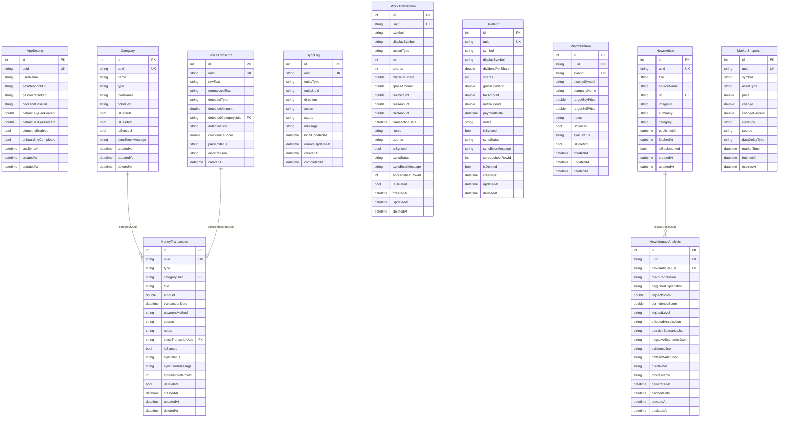
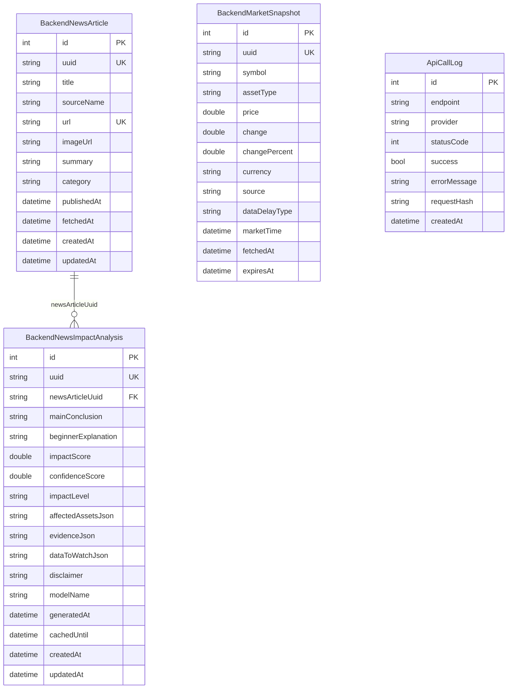

# ERD — MoneyPilot

## 1. Tujuan Dokumen

Dokumen ini menjelaskan rancangan data untuk aplikasi **MoneyPilot**. Dokumen ini menjadi acuan untuk Codex saat membuat model data, local database Isar, struktur Google Spreadsheet, struktur cache backend Flask, repository, proses sinkronisasi, dan perhitungan portofolio.

MoneyPilot menggunakan pendekatan **offline-first**. Artinya, sumber data utama berada di aplikasi mobile melalui **Isar local database**. Google Spreadsheet digunakan sebagai tempat backup dan edit ringan. Backend Flask digunakan untuk mengambil data pasar, mengambil berita, membuat analisis AI, dan menyimpan cache.

Bahasa aplikasi sepenuhnya menggunakan **Bahasa Indonesia**.

---

## 2. Prinsip Arsitektur Data

### 2.1 Local-first dan offline-first

Data utama pengguna disimpan di perangkat menggunakan Isar. Aplikasi harus tetap bisa dipakai untuk mencatat transaksi, melihat data lama, dan membuat catatan portofolio meskipun perangkat sedang offline.

### 2.2 UUID sebagai identitas utama

Setiap data penting wajib memiliki `uuid` bertipe `String`. UUID digunakan sebagai identitas lintas sistem antara:

- Isar local database,
- Google Spreadsheet,
- backend cache jika dibutuhkan,
- proses sync dua arah.

ID bawaan Isar (`Id id`) hanya dipakai untuk kebutuhan lokal Isar. Jangan memakai `id` Isar sebagai identitas sync.

### 2.3 Sinkronisasi dua arah

MoneyPilot mendukung sinkronisasi dua arah sejak MVP:

```text
Isar local database ↔ Google Spreadsheet
```

Aturan dasar:

1. Data dibuat di aplikasi → masuk Isar → dikirim ke Google Spreadsheet.
2. Data diedit di aplikasi → `updatedAt` berubah → dikirim ulang ke Google Spreadsheet dengan mekanisme upsert UUID.
3. Data diedit di Google Spreadsheet → aplikasi menarik perubahan → dibandingkan berdasarkan UUID dan `updatedAt`.
4. Jika data lokal dan spreadsheet sama-sama berubah, gunakan strategi **latest updatedAt wins**.
5. Data tidak langsung dihapus permanen, tetapi memakai soft delete.

### 2.4 Upsert berbasis UUID

Google Apps Script tidak boleh hanya melakukan `appendRow` tanpa pengecekan. Semua sync harus memakai upsert:

```text
Jika UUID sudah ada di spreadsheet → update row
Jika UUID belum ada → insert row baru
```

### 2.5 Soft delete

Data yang dihapus tidak langsung hilang dari database. Setiap entity penting memakai:

```text
isDeleted: bool
deletedAt: DateTime?
```

Jika `isDeleted = true`, data tidak ditampilkan di UI tetapi tetap disinkronkan agar spreadsheet juga tahu status penghapusannya.

### 2.6 Audit waktu

Entity penting wajib memiliki:

```text
createdAt
updatedAt
deletedAt
```

`updatedAt` sangat penting untuk conflict resolution sync dua arah.

### 2.7 Pemisahan data lokal dan backend

Isar menyimpan data personal pengguna. Backend Flask tidak menyimpan data keuangan pribadi pengguna secara permanen. Backend hanya menyimpan cache berita, cache harga pasar, hasil analisis berita, dan log API.

---

## 3. Pembagian Penyimpanan Data

| Area Data | Disimpan di Isar | Disimpan di Google Spreadsheet | Disimpan di Backend SQLite |
|---|---:|---:|---:|
| Pengaturan aplikasi | Ya | Opsional | Tidak |
| Kategori keuangan | Ya | Ya | Tidak |
| Transaksi keuangan | Ya | Ya | Tidak |
| Transkrip voice input | Ya | Opsional | Tidak |
| Log sinkronisasi | Ya | Ya | Tidak |
| Transaksi saham | Ya | Ya | Tidak |
| Dividen | Ya | Ya | Tidak |
| Watchlist | Ya | Ya | Tidak |
| Holding portofolio | Dihitung runtime / snapshot opsional | Ya, sebagai ringkasan | Tidak |
| Snapshot portofolio | Opsional | Opsional | Tidak |
| Berita | Cache lokal opsional | Tidak | Ya |
| Analisis berita | Cache lokal opsional | Tidak | Ya |
| Harga pasar | Cache lokal opsional | Tidak | Ya |
| Log API backend | Tidak | Tidak | Ya |

---

## 4. Entity Final

### 4.1 AppSetting

Menyimpan konfigurasi lokal aplikasi.

| Field | Tipe Data | Wajib | Index | Keterangan |
|---|---|---:|---:|---|
| id | Id | Ya | Ya | ID internal Isar |
| uuid | String | Ya | Unique | UUID setting |
| userName | String? | Tidak | Tidak | Nama panggilan pengguna |
| gasWebhookUrl | String? | Tidak | Tidak | URL Google Apps Script Web App |
| gasSecretToken | String? | Tidak | Tidak | Secret token untuk validasi request ke GAS |
| backendBaseUrl | String? | Tidak | Tidak | URL backend Flask |
| defaultBuyFeePercent | double | Ya | Tidak | Fee beli saham default |
| defaultSellFeePercent | double | Ya | Tidak | Fee jual saham default |
| biometricEnabled | bool | Ya | Tidak | Status fingerprint/biometric lock |
| onboardingCompleted | bool | Ya | Tidak | Status onboarding |
| lastSyncAt | DateTime? | Tidak | Tidak | Waktu sync terakhir |
| createdAt | DateTime | Ya | Tidak | Waktu dibuat |
| updatedAt | DateTime | Ya | Tidak | Waktu diperbarui |

Catatan implementasi:

- Data ini biasanya hanya satu record.
- Jangan simpan API key market data atau AI langsung di Flutter.
- API key eksternal hanya boleh berada di backend Flask.

---

### 4.2 Category

Menyimpan kategori transaksi keuangan.

| Field | Tipe Data | Wajib | Index | Keterangan |
|---|---|---:|---:|---|
| id | Id | Ya | Ya | ID internal Isar |
| uuid | String | Ya | Unique | Identitas kategori lintas sync |
| name | String | Ya | Ya | Nama kategori, contoh Makanan & Minuman |
| type | String | Ya | Ya | `income`, `expense`, atau `both` |
| iconName | String? | Tidak | Tidak | Nama ikon |
| colorHex | String? | Tidak | Tidak | Warna kategori |
| isDefault | bool | Ya | Tidak | Kategori bawaan sistem atau bukan |
| isDeleted | bool | Ya | Ya | Soft delete |
| isSynced | bool | Ya | Ya | Status sync |
| syncErrorMessage | String? | Tidak | Tidak | Pesan error sync terakhir |
| createdAt | DateTime | Ya | Tidak | Waktu dibuat |
| updatedAt | DateTime | Ya | Ya | Waktu diperbarui |
| deletedAt | DateTime? | Tidak | Tidak | Waktu dihapus |

Kategori default MVP:

#### Pengeluaran

- Makanan & Minuman
- Transportasi
- Kos/Asrama
- Kuliah
- Hiburan
- Investasi
- Tabungan
- Kesehatan
- Pulsa & Internet
- Lainnya

#### Pemasukan

- Uang Orang Tua
- Freelance
- Beasiswa
- Gaji
- Dividen
- Hadiah
- Lainnya

---

### 4.3 MoneyTransaction

Menyimpan pemasukan dan pengeluaran pribadi.

| Field | Tipe Data | Wajib | Index | Keterangan |
|---|---|---:|---:|---|
| id | Id | Ya | Ya | ID internal Isar |
| uuid | String | Ya | Unique | Identitas transaksi lintas sync |
| type | String | Ya | Ya | `income` atau `expense` |
| categoryUuid | String | Ya | Ya | UUID kategori |
| title | String | Ya | Ya | Judul transaksi, contoh Nasi goreng |
| amount | double | Ya | Ya | Nominal transaksi |
| transactionDate | DateTime | Ya | Ya | Tanggal transaksi |
| paymentMethod | String? | Tidak | Tidak | Tunai, transfer, e-wallet, dll |
| source | String | Ya | Ya | `manual`, `voice`, `spreadsheet`, `system` |
| notes | String? | Tidak | Tidak | Catatan pengguna |
| voiceTranscriptUuid | String? | Tidak | Ya | Relasi ke VoiceTranscript jika dibuat dari voice |
| isSynced | bool | Ya | Ya | Status sync |
| syncStatus | String | Ya | Ya | `pending`, `synced`, `failed`, `conflict` |
| syncErrorMessage | String? | Tidak | Tidak | Pesan error sync |
| spreadsheetRowId | int? | Tidak | Tidak | Nomor row spreadsheet jika diketahui |
| isDeleted | bool | Ya | Ya | Soft delete |
| createdAt | DateTime | Ya | Tidak | Waktu dibuat |
| updatedAt | DateTime | Ya | Ya | Waktu diperbarui |
| deletedAt | DateTime? | Tidak | Tidak | Waktu dihapus |

Aturan:

- Transaksi dari voice input harus masuk halaman konfirmasi dulu.
- Edit transaksi yang sudah sync diperbolehkan.
- Saat transaksi diedit, ubah `updatedAt` dan set `isSynced = false`.
- Jika transaksi dibuat dari spreadsheet, `source = spreadsheet`.

---

### 4.4 VoiceTranscript

Menyimpan hasil transkripsi suara dan hasil parsing.

| Field | Tipe Data | Wajib | Index | Keterangan |
|---|---|---:|---:|---|
| id | Id | Ya | Ya | ID internal Isar |
| uuid | String | Ya | Unique | Identitas transcript |
| rawText | String | Ya | Tidak | Teks asli dari speech-to-text |
| normalizedText | String? | Tidak | Tidak | Teks hasil normalisasi |
| detectedType | String? | Tidak | Tidak | `income` atau `expense` hasil deteksi |
| detectedAmount | double? | Tidak | Tidak | Nominal hasil deteksi |
| detectedCategoryUuid | String? | Tidak | Tidak | Kategori hasil deteksi |
| detectedTitle | String? | Tidak | Tidak | Judul hasil deteksi |
| confidenceScore | double | Ya | Tidak | Skor keyakinan parser 0–100 |
| parserStatus | String | Ya | Ya | `success`, `needs_review`, `failed` |
| errorReason | String? | Tidak | Tidak | Alasan gagal parsing |
| createdAt | DateTime | Ya | Ya | Waktu dibuat |

Aturan:

- Raw transcript sebaiknya tetap disimpan agar pengguna bisa mengecek kesalahan.
- Jika nominal tidak terdeteksi, arahkan pengguna ke form manual dengan transcript di catatan.
- Transcript tidak wajib disinkronkan ke spreadsheet untuk MVP, tetapi boleh jika pengguna ingin backup.

---

### 4.5 SyncLog

Mencatat proses sinkronisasi dua arah.

| Field | Tipe Data | Wajib | Index | Keterangan |
|---|---|---:|---:|---|
| id | Id | Ya | Ya | ID internal Isar |
| uuid | String | Ya | Unique | Identitas log |
| entityType | String | Ya | Ya | Jenis entity, contoh `money_transaction` |
| entityUuid | String | Ya | Ya | UUID data yang disinkronkan |
| direction | String | Ya | Ya | `local_to_sheet` atau `sheet_to_local` |
| action | String | Ya | Ya | `insert`, `update`, `delete`, `skip`, `conflict` |
| status | String | Ya | Ya | `pending`, `success`, `failed` |
| message | String? | Tidak | Tidak | Pesan hasil sync |
| localUpdatedAt | DateTime? | Tidak | Tidak | updatedAt lokal saat sync |
| remoteUpdatedAt | DateTime? | Tidak | Tidak | updatedAt spreadsheet saat sync |
| createdAt | DateTime | Ya | Ya | Waktu log dibuat |
| completedAt | DateTime? | Tidak | Tidak | Waktu sync selesai |

Aturan:

- SyncLog membantu debugging dan menampilkan status di UI.
- Jangan biarkan SyncLog tumbuh tanpa batas. Nanti bisa dibuat pembersihan log lama pada post-MVP.

---

### 4.6 StockTransaction

Menyimpan transaksi beli/jual saham manual.

| Field | Tipe Data | Wajib | Index | Keterangan |
|---|---|---:|---:|---|
| id | Id | Ya | Ya | ID internal Isar |
| uuid | String | Ya | Unique | Identitas transaksi saham |
| symbol | String | Ya | Ya | Kode saham, contoh `BBCA.JK` |
| displaySymbol | String | Ya | Ya | Tampilan kode, contoh `BBCA` |
| actionType | String | Ya | Ya | `buy` atau `sell` |
| lot | int | Ya | Tidak | Jumlah lot |
| shares | int | Ya | Tidak | Jumlah lembar. 1 lot = 100 lembar |
| pricePerShare | double | Ya | Tidak | Harga per lembar |
| grossAmount | double | Ya | Tidak | shares × pricePerShare |
| feePercent | double | Ya | Tidak | Persentase fee |
| feeAmount | double | Ya | Tidak | Nominal fee |
| netAmount | double | Ya | Tidak | Total setelah fee |
| transactionDate | DateTime | Ya | Ya | Tanggal transaksi |
| notes | String? | Tidak | Tidak | Catatan transaksi |
| source | String | Ya | Ya | `manual`, `spreadsheet` |
| isSynced | bool | Ya | Ya | Status sync |
| syncStatus | String | Ya | Ya | `pending`, `synced`, `failed`, `conflict` |
| syncErrorMessage | String? | Tidak | Tidak | Pesan error sync |
| spreadsheetRowId | int? | Tidak | Tidak | Row spreadsheet |
| isDeleted | bool | Ya | Ya | Soft delete |
| createdAt | DateTime | Ya | Tidak | Waktu dibuat |
| updatedAt | DateTime | Ya | Ya | Waktu diperbarui |
| deletedAt | DateTime? | Tidak | Tidak | Waktu dihapus |

Aturan perhitungan:

- Metode MVP menggunakan **Weighted Average Cost / Moving Average Cost**.
- Beli menambah jumlah saham dan memengaruhi average price.
- Jual mengurangi jumlah saham dan menghasilkan realized P/L.
- Dividen tidak mengubah average price.

---

### 4.7 Dividend

Menyimpan dividen saham yang diterima pengguna.

| Field | Tipe Data | Wajib | Index | Keterangan |
|---|---|---:|---:|---|
| id | Id | Ya | Ya | ID internal Isar |
| uuid | String | Ya | Unique | Identitas dividen |
| symbol | String | Ya | Ya | Kode saham, contoh `BBCA.JK` |
| displaySymbol | String | Ya | Ya | Tampilan kode, contoh `BBCA` |
| dividendPerShare | double | Ya | Tidak | Dividen per lembar |
| shares | int | Ya | Tidak | Jumlah lembar yang menerima dividen |
| grossDividend | double | Ya | Tidak | dividendPerShare × shares |
| taxAmount | double | Ya | Tidak | Pajak dividen jika ada |
| netDividend | double | Ya | Tidak | Dividen bersih |
| paymentDate | DateTime | Ya | Ya | Tanggal pembayaran dividen |
| notes | String? | Tidak | Tidak | Catatan |
| isSynced | bool | Ya | Ya | Status sync |
| syncStatus | String | Ya | Ya | `pending`, `synced`, `failed`, `conflict` |
| syncErrorMessage | String? | Tidak | Tidak | Pesan error sync |
| spreadsheetRowId | int? | Tidak | Tidak | Row spreadsheet |
| isDeleted | bool | Ya | Ya | Soft delete |
| createdAt | DateTime | Ya | Tidak | Waktu dibuat |
| updatedAt | DateTime | Ya | Ya | Waktu diperbarui |
| deletedAt | DateTime? | Tidak | Tidak | Waktu dihapus |

Aturan:

- Dividen masuk perhitungan total return portofolio.
- Dividen juga dapat masuk laporan pemasukan jika pengguna mengaktifkan opsi “masukkan dividen ke arus kas”.
- Untuk MVP, dividen dicatat manual.

---

### 4.8 WatchlistItem

Menyimpan saham yang ingin dipantau.

| Field | Tipe Data | Wajib | Index | Keterangan |
|---|---|---:|---:|---|
| id | Id | Ya | Ya | ID internal Isar |
| uuid | String | Ya | Unique | Identitas watchlist |
| symbol | String | Ya | Unique | Kode saham, contoh `BBRI.JK` |
| displaySymbol | String | Ya | Ya | Tampilan kode, contoh `BBRI` |
| companyName | String? | Tidak | Tidak | Nama perusahaan |
| targetBuyPrice | double? | Tidak | Tidak | Target harga beli opsional |
| targetSellPrice | double? | Tidak | Tidak | Target harga jual opsional |
| notes | String? | Tidak | Tidak | Catatan pemantauan |
| isSynced | bool | Ya | Ya | Status sync |
| syncStatus | String | Ya | Ya | Status sync |
| isDeleted | bool | Ya | Ya | Soft delete |
| createdAt | DateTime | Ya | Tidak | Waktu dibuat |
| updatedAt | DateTime | Ya | Ya | Waktu diperbarui |
| deletedAt | DateTime? | Tidak | Tidak | Waktu dihapus |

Catatan:

- Watchlist digunakan oleh tab Portofolio dan tab Analisis.
- Watchlist bukan rekomendasi beli/jual.

---

### 4.9 PortfolioHolding

PortfolioHolding adalah hasil kalkulasi dari `StockTransaction`, `Dividend`, dan `MarketSnapshot`. Untuk MVP, holding **tidak wajib disimpan sebagai entity permanen** agar tidak terjadi mismatch data.

Namun, Codex boleh membuat model DTO/runtime bernama `PortfolioHolding`.

| Field | Tipe Data | Keterangan |
|---|---|---|
| symbol | String | Kode saham |
| displaySymbol | String | Kode tampilan |
| companyName | String? | Nama perusahaan |
| totalShares | int | Jumlah lembar tersisa |
| totalLot | int | Jumlah lot tersisa |
| averagePrice | double | Harga rata-rata berbasis moving average |
| currentPrice | double? | Harga pasar dari backend atau input manual |
| investedAmount | double | Total modal tersisa |
| marketValue | double | currentPrice × totalShares |
| unrealizedProfitLoss | double | marketValue - investedAmount |
| unrealizedProfitLossPercent | double | Persentase unrealized P/L |
| realizedProfitLoss | double | Total realized P/L dari transaksi jual |
| totalDividend | double | Total dividen bersih |
| totalReturn | double | realized + unrealized + dividend |
| allocationPercent | double | Bobot saham dalam portofolio |
| lastPriceUpdatedAt | DateTime? | Waktu harga terakhir diperbarui |

Aturan:

- Jika performa kalkulasi masih ringan, hitung ulang dari transaksi setiap membuka Portofolio.
- Jika data makin besar, post-MVP boleh menyimpan snapshot holding.

---

### 4.10 PortfolioSnapshot

Snapshot nilai portofolio untuk grafik historis. Untuk MVP, entity ini opsional. Jika dibuat, gunakan untuk menyimpan nilai portofolio per hari.

| Field | Tipe Data | Wajib | Index | Keterangan |
|---|---|---:|---:|---|
| id | Id | Ya | Ya | ID internal Isar |
| uuid | String | Ya | Unique | Identitas snapshot |
| snapshotDate | DateTime | Ya | Ya | Tanggal snapshot |
| totalInvested | double | Ya | Tidak | Total modal |
| totalMarketValue | double | Ya | Tidak | Total nilai pasar |
| totalUnrealizedProfitLoss | double | Ya | Tidak | Total floating P/L |
| totalRealizedProfitLoss | double | Ya | Tidak | Total realized P/L |
| totalDividend | double | Ya | Tidak | Total dividen |
| totalReturn | double | Ya | Tidak | Total return |
| createdAt | DateTime | Ya | Tidak | Waktu dibuat |

Rekomendasi:

- Untuk MVP awal, snapshot boleh ditunda.
- Jika ingin grafik nilai portofolio historis dari awal, buat snapshot harian saat aplikasi membuka tab Portofolio.

---

### 4.11 NewsArticle

Menyimpan cache berita di Flutter dan backend.

| Field | Tipe Data | Wajib | Index | Keterangan |
|---|---|---:|---:|---|
| id | Id / int | Ya | Ya | ID lokal Isar atau SQLite |
| uuid | String | Ya | Unique | Identitas berita |
| title | String | Ya | Ya | Judul berita |
| sourceName | String | Ya | Ya | Sumber berita |
| url | String | Ya | Unique | URL berita |
| imageUrl | String? | Tidak | Tidak | Gambar berita |
| summary | String? | Tidak | Tidak | Ringkasan singkat |
| category | String | Ya | Ya | Kategori berita |
| publishedAt | DateTime | Ya | Ya | Waktu publikasi |
| fetchedAt | DateTime | Ya | Tidak | Waktu diambil backend |
| isBookmarked | bool | Ya | Ya | Status bookmark lokal |
| createdAt | DateTime | Ya | Tidak | Waktu dibuat |
| updatedAt | DateTime | Ya | Tidak | Waktu diperbarui |

Kategori berita MVP:

- Ekonomi Indonesia
- Ekonomi Global
- Saham
- Forex
- Komoditas
- Geopolitik
- Suku Bunga
- Inflasi
- IPO
- Regulasi

Catatan:

- Backend Flask menjadi sumber utama berita.
- Isar boleh menyimpan cache berita untuk pengalaman offline.

---

### 4.12 NewsImpactAnalysis

Menyimpan hasil analisis berita dari AI backend.

| Field | Tipe Data | Wajib | Index | Keterangan |
|---|---|---:|---:|---|
| id | Id / int | Ya | Ya | ID lokal Isar atau SQLite |
| uuid | String | Ya | Unique | Identitas analisis |
| newsArticleUuid | String | Ya | Ya | UUID berita |
| mainConclusion | String | Ya | Tidak | Kesimpulan utama |
| beginnerExplanation | String | Ya | Tidak | Penjelasan untuk pemula |
| impactScore | double | Ya | Ya | Skor dampak 0–100 |
| confidenceScore | double | Ya | Ya | Skor keyakinan 0–100 |
| impactLevel | String | Ya | Ya | `rendah`, `sedang`, `tinggi` |
| affectedAssetsJson | String | Ya | Tidak | JSON daftar aset terdampak |
| positiveScenariosJson | String | Ya | Tidak | JSON skenario positif |
| negativeScenariosJson | String | Ya | Tidak | JSON skenario negatif |
| evidenceJson | String | Ya | Tidak | JSON bukti/data pendukung |
| dataToWatchJson | String | Ya | Tidak | JSON data yang perlu dipantau |
| disclaimer | String | Ya | Tidak | Disclaimer edukatif |
| modelName | String? | Tidak | Tidak | Model AI yang digunakan |
| generatedAt | DateTime | Ya | Ya | Waktu analisis dibuat |
| cachedUntil | DateTime? | Tidak | Ya | Batas cache |
| createdAt | DateTime | Ya | Tidak | Waktu dibuat |
| updatedAt | DateTime | Ya | Tidak | Waktu diperbarui |

Aturan:

- Analisis tidak boleh memberi rekomendasi beli/jual/tahan.
- Jika data pasar kurang, `confidenceScore` harus rendah dan UI menampilkan pesan hati-hati.
- Output backend harus berbentuk JSON yang bisa langsung dirender Flutter.

---

### 4.13 MarketSnapshot

Menyimpan cache harga pasar dari backend dan opsional cache lokal di Flutter.

| Field | Tipe Data | Wajib | Index | Keterangan |
|---|---|---:|---:|---|
| id | Id / int | Ya | Ya | ID lokal Isar atau SQLite |
| uuid | String | Ya | Unique | Identitas snapshot |
| symbol | String | Ya | Ya | Simbol, contoh `BBCA.JK`, `USDIDR`, `XAUUSD` |
| assetType | String | Ya | Ya | `stock`, `index`, `forex`, `commodity`, `macro` |
| price | double | Ya | Tidak | Harga terakhir |
| change | double? | Tidak | Tidak | Perubahan nominal |
| changePercent | double? | Tidak | Tidak | Perubahan persen |
| currency | String? | Tidak | Tidak | Mata uang |
| source | String | Ya | Ya | EODHD, Twelve Data, FRED, dll |
| dataDelayType | String | Ya | Tidak | `real_time`, `delayed`, `eod` |
| marketTime | DateTime? | Tidak | Ya | Waktu data pasar |
| fetchedAt | DateTime | Ya | Ya | Waktu data diambil |
| expiresAt | DateTime? | Tidak | Ya | Waktu cache kadaluarsa |

Aturan:

- Backend Flask menjadi pusat pengambilan harga pasar.
- Flutter memanggil backend, bukan API eksternal langsung.
- Jika backend gagal, UI menyediakan fallback input harga manual.

---

### 4.14 EvidenceItem

EvidenceItem adalah bagian dari hasil analisis berita. Untuk MVP, boleh disimpan sebagai JSON di `NewsImpactAnalysis.evidenceJson`. Jika ingin dibuat entity terpisah, gunakan struktur berikut.

| Field | Tipe Data | Wajib | Index | Keterangan |
|---|---|---:|---:|---|
| id | int | Ya | Ya | ID SQLite/backend |
| uuid | String | Ya | Unique | Identitas evidence |
| analysisUuid | String | Ya | Ya | UUID analisis |
| label | String | Ya | Tidak | Nama bukti, contoh Harga Emas |
| symbol | String? | Tidak | Ya | Simbol data pasar |
| value | String | Ya | Tidak | Nilai data |
| changePercent | double? | Tidak | Tidak | Perubahan persen |
| source | String | Ya | Tidak | Sumber data |
| explanation | String | Ya | Tidak | Penjelasan singkat |
| fetchedAt | DateTime | Ya | Tidak | Waktu data diambil |

---

### 4.15 ApiCallLog

Menyimpan log pemanggilan API backend. Hanya di backend SQLite.

| Field | Tipe Data | Wajib | Index | Keterangan |
|---|---|---:|---:|---|
| id | int | Ya | Ya | ID SQLite |
| endpoint | String | Ya | Ya | Endpoint backend |
| provider | String? | Tidak | Ya | Provider eksternal |
| statusCode | int | Ya | Tidak | Status HTTP |
| success | bool | Ya | Ya | Berhasil atau gagal |
| errorMessage | String? | Tidak | Tidak | Error jika ada |
| requestHash | String? | Tidak | Ya | Hash request untuk cache/debug |
| createdAt | DateTime | Ya | Ya | Waktu log |

---

## 5. Mermaid ERD — Local Isar



Catatan Mermaid:

- Relasi di diagram bersifat konseptual.
- Di Isar, relasi utama tetap ditangani melalui `uuid`, bukan foreign key database tradisional.

---

## 6. Mermaid ERD — Backend SQLite



---

## 7. Struktur Google Spreadsheet

Google Spreadsheet digunakan sebagai backup dan tempat edit ringan. Sheet harus memakai header yang konsisten. Semua sheet utama wajib memiliki kolom `UUID`, `Created At`, `Updated At`, `Deleted At`, dan `Is Deleted` jika datanya bisa disinkronkan dua arah.

### 7.1 Sheet: `Transactions`

| Column | Tipe | Contoh | Dibuat oleh | Editable | Sync Direction |
|---|---|---|---|---:|---|
| UUID | string | `uuid-v4` | App | Tidak disarankan | Dua arah |
| Type | string | `expense` | App/User | Ya | Dua arah |
| Category UUID | string | `uuid-category` | App | Ya | Dua arah |
| Category Name | string | `Makanan & Minuman` | App | Ya | Dua arah |
| Title | string | `Nasi goreng` | App/User | Ya | Dua arah |
| Amount | number | `25000` | App/User | Ya | Dua arah |
| Transaction Date | datetime | `2026-07-09` | App/User | Ya | Dua arah |
| Payment Method | string | `Tunai` | App/User | Ya | Dua arah |
| Source | string | `voice` | App | Tidak disarankan | Dua arah |
| Notes | string | `beli nasi goreng` | App/User | Ya | Dua arah |
| Voice Transcript UUID | string | `uuid-transcript` | App | Tidak disarankan | App → Sheet |
| Is Deleted | boolean | `false` | App/User | Ya | Dua arah |
| Created At | datetime | `2026-07-09T08:00:00` | App | Tidak disarankan | Dua arah |
| Updated At | datetime | `2026-07-09T08:05:00` | App/User | Ya | Dua arah |
| Deleted At | datetime | empty | App/User | Ya | Dua arah |

---

### 7.2 Sheet: `Categories`

| Column | Tipe | Contoh | Dibuat oleh | Editable | Sync Direction |
|---|---|---|---|---:|---|
| UUID | string | `uuid-v4` | App | Tidak disarankan | Dua arah |
| Name | string | `Makanan & Minuman` | App/User | Ya | Dua arah |
| Type | string | `expense` | App/User | Ya | Dua arah |
| Icon Name | string | `utensils` | App/User | Ya | Dua arah |
| Color Hex | string | `#2563EB` | App/User | Ya | Dua arah |
| Is Default | boolean | `true` | App | Tidak disarankan | Dua arah |
| Is Deleted | boolean | `false` | App/User | Ya | Dua arah |
| Created At | datetime | ISO datetime | App | Tidak disarankan | Dua arah |
| Updated At | datetime | ISO datetime | App/User | Ya | Dua arah |
| Deleted At | datetime | empty | App/User | Ya | Dua arah |

---

### 7.3 Sheet: `Stock_Transactions`

| Column | Tipe | Contoh | Dibuat oleh | Editable | Sync Direction |
|---|---|---|---|---:|---|
| UUID | string | `uuid-v4` | App | Tidak disarankan | Dua arah |
| Symbol | string | `BBCA.JK` | App/User | Ya | Dua arah |
| Display Symbol | string | `BBCA` | App/User | Ya | Dua arah |
| Action Type | string | `buy` | App/User | Ya | Dua arah |
| Lot | number | `2` | App/User | Ya | Dua arah |
| Shares | number | `200` | App | Ya | Dua arah |
| Price Per Share | number | `9000` | App/User | Ya | Dua arah |
| Gross Amount | number | `1800000` | App | Tidak disarankan | App → Sheet |
| Fee Percent | number | `0.15` | App/User | Ya | Dua arah |
| Fee Amount | number | `2700` | App | Tidak disarankan | App → Sheet |
| Net Amount | number | `1802700` | App | Tidak disarankan | App → Sheet |
| Transaction Date | datetime | `2026-07-09` | App/User | Ya | Dua arah |
| Notes | string | `Entry awal` | App/User | Ya | Dua arah |
| Source | string | `manual` | App | Tidak disarankan | Dua arah |
| Is Deleted | boolean | `false` | App/User | Ya | Dua arah |
| Created At | datetime | ISO datetime | App | Tidak disarankan | Dua arah |
| Updated At | datetime | ISO datetime | App/User | Ya | Dua arah |
| Deleted At | datetime | empty | App/User | Ya | Dua arah |

---

### 7.4 Sheet: `Dividends`

| Column | Tipe | Contoh | Dibuat oleh | Editable | Sync Direction |
|---|---|---|---|---:|---|
| UUID | string | `uuid-v4` | App | Tidak disarankan | Dua arah |
| Symbol | string | `BBCA.JK` | App/User | Ya | Dua arah |
| Display Symbol | string | `BBCA` | App/User | Ya | Dua arah |
| Dividend Per Share | number | `100` | App/User | Ya | Dua arah |
| Shares | number | `200` | App/User | Ya | Dua arah |
| Gross Dividend | number | `20000` | App | Tidak disarankan | App → Sheet |
| Tax Amount | number | `2000` | App/User | Ya | Dua arah |
| Net Dividend | number | `18000` | App | Tidak disarankan | App → Sheet |
| Payment Date | datetime | `2026-07-09` | App/User | Ya | Dua arah |
| Notes | string | `Dividen tahunan` | App/User | Ya | Dua arah |
| Is Deleted | boolean | `false` | App/User | Ya | Dua arah |
| Created At | datetime | ISO datetime | App | Tidak disarankan | Dua arah |
| Updated At | datetime | ISO datetime | App/User | Ya | Dua arah |
| Deleted At | datetime | empty | App/User | Ya | Dua arah |

---

### 7.5 Sheet: `Watchlist`

| Column | Tipe | Contoh | Dibuat oleh | Editable | Sync Direction |
|---|---|---|---|---:|---|
| UUID | string | `uuid-v4` | App | Tidak disarankan | Dua arah |
| Symbol | string | `BBRI.JK` | App/User | Ya | Dua arah |
| Display Symbol | string | `BBRI` | App/User | Ya | Dua arah |
| Company Name | string | `Bank Rakyat Indonesia` | App/User | Ya | Dua arah |
| Target Buy Price | number | `4000` | User | Ya | Dua arah |
| Target Sell Price | number | `5000` | User | Ya | Dua arah |
| Notes | string | `Pantau untuk jangka panjang` | User | Ya | Dua arah |
| Is Deleted | boolean | `false` | App/User | Ya | Dua arah |
| Created At | datetime | ISO datetime | App | Tidak disarankan | Dua arah |
| Updated At | datetime | ISO datetime | App/User | Ya | Dua arah |
| Deleted At | datetime | empty | App/User | Ya | Dua arah |

---

### 7.6 Sheet: `Portfolio_Holdings`

Sheet ini adalah ringkasan hasil kalkulasi. Untuk MVP, sheet ini dapat dihasilkan dari aplikasi, tetapi pengguna tidak disarankan mengeditnya.

| Column | Tipe | Contoh | Dibuat oleh | Editable | Sync Direction |
|---|---|---|---|---:|---|
| Symbol | string | `BBCA.JK` | App | Tidak | App → Sheet |
| Display Symbol | string | `BBCA` | App | Tidak | App → Sheet |
| Total Lot | number | `3` | App | Tidak | App → Sheet |
| Total Shares | number | `300` | App | Tidak | App → Sheet |
| Average Price | number | `8866.67` | App | Tidak | App → Sheet |
| Current Price | number | `9300` | Backend/App | Tidak | App → Sheet |
| Invested Amount | number | `2660000` | App | Tidak | App → Sheet |
| Market Value | number | `2790000` | App | Tidak | App → Sheet |
| Unrealized P/L | number | `130000` | App | Tidak | App → Sheet |
| Unrealized P/L % | number | `4.89` | App | Tidak | App → Sheet |
| Realized P/L | number | `50000` | App | Tidak | App → Sheet |
| Total Dividend | number | `18000` | App | Tidak | App → Sheet |
| Total Return | number | `198000` | App | Tidak | App → Sheet |
| Last Updated At | datetime | ISO datetime | App | Tidak | App → Sheet |

---

### 7.7 Sheet: `Monthly_Summary`

Sheet ringkasan bulanan. Bisa dibuat dari aplikasi atau formula spreadsheet.

| Column | Tipe | Contoh | Dibuat oleh | Editable | Sync Direction |
|---|---|---|---|---:|---|
| Month | string | `2026-07` | App | Tidak | App → Sheet |
| Total Income | number | `1500000` | App | Tidak | App → Sheet |
| Total Expense | number | `850000` | App | Tidak | App → Sheet |
| Net Cashflow | number | `650000` | App | Tidak | App → Sheet |
| Biggest Expense Category | string | `Makanan & Minuman` | App | Tidak | App → Sheet |
| Transaction Count | number | `45` | App | Tidak | App → Sheet |
| Generated At | datetime | ISO datetime | App | Tidak | App → Sheet |

---

### 7.8 Sheet: `Sync_Log`

| Column | Tipe | Contoh | Dibuat oleh | Editable | Sync Direction |
|---|---|---|---|---:|---|
| UUID | string | `uuid-v4` | App | Tidak | App → Sheet |
| Entity Type | string | `money_transaction` | App | Tidak | App → Sheet |
| Entity UUID | string | `uuid-entity` | App | Tidak | App → Sheet |
| Direction | string | `local_to_sheet` | App | Tidak | App → Sheet |
| Action | string | `update` | App | Tidak | App → Sheet |
| Status | string | `success` | App | Tidak | App → Sheet |
| Message | string | `Updated row 12` | App/GAS | Tidak | App → Sheet |
| Created At | datetime | ISO datetime | App | Tidak | App → Sheet |
| Completed At | datetime | ISO datetime | App/GAS | Tidak | App → Sheet |

---

## 8. Aturan Sinkronisasi Dua Arah

### 8.1 Data yang disinkronkan dua arah

- Category
- MoneyTransaction
- StockTransaction
- Dividend
- WatchlistItem

### 8.2 Data yang hanya dikirim dari aplikasi ke spreadsheet

- Portfolio_Holdings
- Monthly_Summary
- Sync_Log

### 8.3 Data yang tidak perlu masuk spreadsheet pada MVP

- NewsArticle
- NewsImpactAnalysis
- MarketSnapshot
- VoiceTranscript, kecuali pengguna mengaktifkan opsi backup transcript

### 8.4 Strategi konflik

Gunakan **latest updatedAt wins**.

```text
Jika local.updatedAt > remote.updatedAt → kirim data lokal ke spreadsheet.
Jika remote.updatedAt > local.updatedAt → tarik data spreadsheet ke lokal.
Jika sama → skip.
```

Jika salah satu data memiliki `isDeleted = true` dan `updatedAt` lebih baru, status delete ikut menang.

### 8.5 Aturan edit setelah sync

- Data yang sudah sync boleh diedit dari aplikasi.
- Setelah edit, set `isSynced = false` dan `syncStatus = pending`.
- Proses sync berikutnya akan meng-update row spreadsheet berdasarkan UUID.

### 8.6 Validasi sync dari spreadsheet

Saat menarik data dari spreadsheet:

1. Validasi UUID.
2. Validasi tipe transaksi.
3. Validasi amount harus angka positif.
4. Validasi tanggal.
5. Validasi symbol saham jika data saham.
6. Jika invalid, jangan overwrite data lokal. Buat SyncLog dengan status `failed`.

---

## 9. Aturan Perhitungan Portofolio

### 9.1 Metode final MVP

Gunakan **Weighted Average Cost / Moving Average Cost**.

### 9.2 Rumus dasar

#### Buy

```text
newTotalShares = oldTotalShares + buyShares
newInvestedAmount = oldInvestedAmount + buyNetAmount
newAveragePrice = newInvestedAmount / newTotalShares
```

#### Sell

```text
costBasisSold = averagePriceBeforeSell × sellShares
realizedProfitLoss = sellNetAmount - costBasisSold
remainingShares = oldTotalShares - sellShares
remainingInvestedAmount = averagePriceBeforeSell × remainingShares
averagePriceAfterSell = averagePriceBeforeSell
```

#### Unrealized P/L

```text
marketValue = currentPrice × totalShares
unrealizedProfitLoss = marketValue - investedAmount
unrealizedProfitLossPercent = unrealizedProfitLoss / investedAmount × 100
```

#### Total Return

```text
totalReturn = realizedProfitLoss + unrealizedProfitLoss + totalNetDividend
```

### 9.3 Dividen

- Dividen menambah total return.
- Dividen tidak mengubah average price.
- Dividen dapat ditampilkan di laporan portofolio.
- Dividen dapat dicatat sebagai pemasukan keuangan jika pengguna mengaktifkan opsi tersebut.

### 9.4 Posisi nol lalu beli lagi

Jika `remainingShares = 0` setelah sell:

```text
averagePrice = 0
investedAmount = 0
```

Jika pengguna membeli lagi setelah posisi nol, mulai perhitungan average price baru.

### 9.5 Corporate action

Untuk MVP:

- Stock split tidak otomatis.
- Reverse split tidak otomatis.
- Rights issue tidak otomatis.
- Bonus shares tidak otomatis.

Codex cukup menyediakan catatan bahwa aksi korporasi kompleks adalah post-MVP.

---

## 10. Backend Data Contract Ringkas

Detail kontrak endpoint akan dijelaskan lebih lanjut pada `MODULAR_IMPLEMENTATION.md`, tetapi ERD ini menetapkan model data backend minimal.

### 10.1 MarketSnapshot response

```json
{
  "status": "success",
  "data": {
    "symbol": "BBCA.JK",
    "assetType": "stock",
    "price": 9300,
    "change": 100,
    "changePercent": 1.09,
    "currency": "IDR",
    "source": "EODHD",
    "dataDelayType": "delayed",
    "marketTime": "2026-07-09T16:00:00+07:00",
    "fetchedAt": "2026-07-09T16:10:00+07:00"
  }
}
```

### 10.2 NewsImpactAnalysis response

```json
{
  "status": "success",
  "data": {
    "analysisUuid": "uuid-analysis",
    "newsArticleUuid": "uuid-news",
    "impactScore": 82,
    "confidenceScore": 76,
    "impactLevel": "tinggi",
    "mainConclusion": "Berita ini berpotensi memberi tekanan pada rupiah dan IHSG jika risiko global meningkat.",
    "beginnerExplanation": "Untuk pemula, berita seperti ini biasanya membuat investor lebih hati-hati dan memilih aset yang dianggap aman.",
    "affectedAssets": ["Emas", "USD/IDR", "IHSG", "Minyak"],
    "evidence": [
      {
        "label": "Harga emas",
        "value": "naik 1.2%",
        "source": "market_api",
        "explanation": "Kenaikan emas mendukung sinyal risk-off."
      }
    ],
    "dataToWatch": ["DXY", "USD/IDR", "Brent", "IHSG"],
    "disclaimer": "Analisis ini bersifat edukatif dan bukan rekomendasi beli atau jual."
  }
}
```

---

## 11. Catatan Implementasi untuk Codex

1. Gunakan Isar dengan anotasi `@collection` untuk entity lokal.
2. Setiap entity sync wajib memiliki `uuid`, `isSynced`, `syncStatus`, `isDeleted`, `createdAt`, `updatedAt`, dan `deletedAt`.
3. Jangan memakai ID lokal Isar untuk sync.
4. Relasi lokal cukup memakai UUID string, bukan relasi foreign key kompleks.
5. PortfolioHolding dihitung dari StockTransaction dan Dividend, bukan menjadi sumber data utama.
6. Google Apps Script wajib memakai upsert berdasarkan UUID.
7. Sync dua arah wajib memakai conflict resolution berbasis `updatedAt`.
8. Backend Flask tidak boleh menyimpan data keuangan pribadi pengguna.
9. Flutter tidak boleh menyimpan API key market data atau AI provider.
10. Jika backend market price gagal, UI harus menyediakan fallback input harga manual.
11. News AI analysis wajib menyertakan disclaimer dan tidak boleh memberi rekomendasi beli/jual.
12. Semua field nominal uang gunakan `double` di Dart, tetapi saat menghitung bisa pertimbangkan pembulatan agar tidak terjadi tampilan desimal aneh.
13. Semua tanggal disimpan dalam ISO 8601 saat dikirim ke spreadsheet atau backend.
14. Semua enum dapat dibuat sebagai string pada MVP agar lebih mudah sync dengan spreadsheet.

---

## 12. Ringkasan Entity Berdasarkan Modul

### Modul Keamanan dan Pengaturan

- AppSetting

### Modul Keuangan

- Category
- MoneyTransaction
- VoiceTranscript
- SyncLog

### Modul Portofolio

- StockTransaction
- Dividend
- WatchlistItem
- PortfolioHolding DTO/runtime
- PortfolioSnapshot opsional
- MarketSnapshot cache

### Modul Berita

- NewsArticle
- NewsImpactAnalysis
- EvidenceItem opsional
- MarketSnapshot

### Modul Backend

- BackendNewsArticle
- BackendNewsImpactAnalysis
- BackendMarketSnapshot
- ApiCallLog

---

## 13. Definition of Done untuk ERD

Dokumen ERD dianggap selesai jika Codex dapat menggunakan dokumen ini untuk:

1. Membuat model Isar awal tanpa kebingungan field.
2. Membuat repository lokal untuk transaksi, kategori, portofolio, watchlist, dan berita.
3. Membuat struktur spreadsheet dengan header yang konsisten.
4. Membuat mekanisme sync dua arah berbasis UUID dan updatedAt.
5. Membuat perhitungan portofolio berbasis moving average.
6. Membuat struktur cache backend untuk berita, market data, dan analisis AI.
7. Menghindari penyimpanan API key eksternal di Flutter.
8. Menghindari duplikasi data saat sync ke spreadsheet.
9. Menangani edit data yang sudah tersinkronisasi.
10. Menangani soft delete secara konsisten.