# USER FLOW — MoneyPilot

## 1. Tujuan Dokumen

Dokumen ini menjelaskan alur penggunaan aplikasi **MoneyPilot** dari sudut pandang pengguna. Dokumen ini menjadi panduan untuk Codex agar implementasi navigasi, screen, state, dan perpindahan antarfitur tidak melenceng dari kebutuhan produk.

MoneyPilot adalah aplikasi mobile personal finance intelligence berbasis Flutter yang membantu pengguna mencatat keuangan harian, mencatat transaksi melalui suara, menyinkronkan data dengan Google Spreadsheet, memantau portofolio saham, membaca berita keuangan, dan memahami dampak berita terhadap pasar melalui analisis AI berbasis data.

Bahasa aplikasi sepenuhnya menggunakan **Bahasa Indonesia**.

---

## 2. Prinsip User Flow

1. **Cepat untuk pencatatan harian**  
   Pengguna harus bisa mencatat pengeluaran atau pemasukan dalam beberapa langkah saja.

2. **Selalu ada konfirmasi untuk input suara**  
   Hasil voice input tidak boleh langsung disimpan tanpa persetujuan pengguna.

3. **Offline-first**  
   Transaksi tetap bisa dibuat saat offline, lalu masuk antrean sinkronisasi.

4. **Data utama berada di aplikasi lokal**  
   Isar menjadi penyimpanan utama. Google Spreadsheet berfungsi sebagai backup dan tempat edit ringan.

5. **Sinkronisasi dua arah sejak MVP**  
   Data dari aplikasi dapat dikirim ke spreadsheet, dan perubahan dari spreadsheet dapat ditarik kembali ke aplikasi.

6. **Keamanan sejak awal**  
   Pengguna harus melewati autentikasi fingerprint/biometric sebelum masuk aplikasi.

7. **Analisis berita harus hati-hati**  
   Analisis berita tidak boleh berbunyi seperti rekomendasi beli/jual. Semua hasil analisis harus disajikan sebagai edukasi dan probabilitas.

8. **UI minimalis**  
   Navigasi harus sederhana, rapi, dominan putih–hitam–biru, dan minim card berlebihan.

---

## 3. Navigasi Utama

Bottom navigation MoneyPilot terdiri dari 5 tab utama:

1. **Beranda**
2. **Berita**
3. **Keuangan**
4. **Portofolio**
5. **Analisis**

Urutan ini wajib digunakan secara konsisten di seluruh aplikasi.

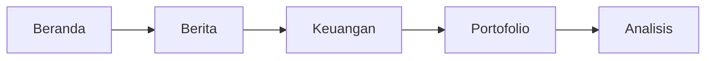

---

## 4. Sitemap Aplikasi

```text
MoneyPilot
├── Autentikasi
│   ├── Splash Screen
│   ├── Fingerprint / Biometric Lock
│   └── Fallback Error State
│
├── Onboarding
│   ├── Selamat Datang
│   ├── Nama Panggilan
│   ├── Izin Mikrofon
│   ├── Izin Biometric
│   ├── Setup Google Spreadsheet
│   ├── Setup Kategori Awal
│   └── Setup Fee Saham
│
├── Beranda
│   ├── Ringkasan Bulan Ini
│   ├── Status Sinkronisasi
│   ├── Transaksi Terbaru
│   ├── Ringkasan Portofolio
│   ├── Berita Penting
│   └── Aksi Cepat
│
├── Berita
│   ├── Daftar Berita
│   ├── Filter Berita
│   ├── Detail Berita
│   ├── Analisis Dampak AI
│   ├── Bookmark Berita
│   └── Berita Tersimpan
│
├── Keuangan
│   ├── Daftar Transaksi
│   ├── Tambah Transaksi Manual
│   ├── Input Suara
│   ├── Konfirmasi Transaksi Suara
│   ├── Edit Transaksi
│   ├── Kategori
│   ├── Laporan Bulanan
│   └── Sinkronisasi Spreadsheet
│
├── Portofolio
│   ├── Ringkasan Portofolio
│   ├── Daftar Holding
│   ├── Detail Holding
│   ├── Tambah Transaksi Saham
│   ├── Edit Transaksi Saham
│   ├── Catat Dividen
│   ├── Watchlist
│   └── Update Harga Pasar
│
├── Analisis
│   ├── Placeholder Analisis Saham
│   ├── Placeholder Analisis Forex
│   ├── Watchlist Analisis
│   └── Catatan Pengembangan
│
└── Pengaturan
    ├── Profil Lokal
    ├── Biometric Lock
    ├── Google Spreadsheet
    ├── Kategori
    ├── Fee Saham
    ├── Backup / Export
    ├── Reset Data
    └── Tentang & Disclaimer
```

---

## 5. Flow Awal Aplikasi

### 5.1 Flow Splash dan Biometric Lock

Ketika aplikasi dibuka, sistem harus memeriksa apakah onboarding sudah selesai dan apakah biometric lock aktif.

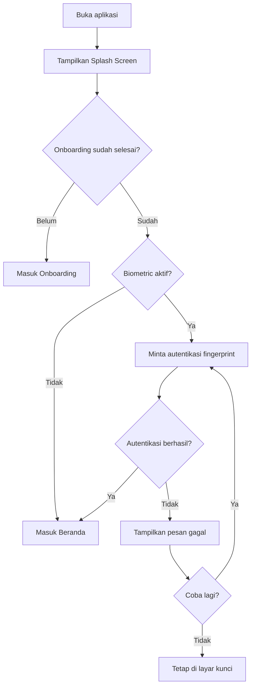

### State yang harus didukung

- Fingerprint tersedia dan berhasil.
- Fingerprint tersedia tetapi gagal.
- Fingerprint tidak tersedia di perangkat.
- User belum mengaktifkan biometric di HP.
- User membatalkan autentikasi.

### Microcopy

```text
Buka MoneyPilot dengan fingerprint Anda.
```

```text
Autentikasi gagal. Coba lagi untuk masuk ke aplikasi.
```

---

## 6. Flow Onboarding

Onboarding hanya muncul saat aplikasi pertama kali dipakai atau setelah user melakukan reset data.

### 6.1 Tahapan Onboarding

1. Selamat datang di MoneyPilot.
2. Isi nama panggilan.
3. Aktifkan fingerprint/biometric.
4. Izinkan microphone untuk input suara.
5. Setup Google Spreadsheet.
6. Konfirmasi kategori awal.
7. Setup fee saham default.
8. Selesai dan masuk Beranda.

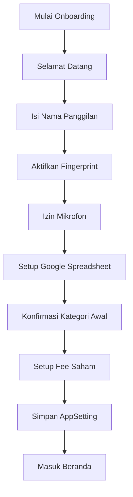

### 6.2 Setup Google Spreadsheet

Pada MVP, user perlu memasukkan konfigurasi Google Apps Script Web App URL dan secret token.

Jika user belum punya URL, aplikasi boleh menampilkan status:

```text
Spreadsheet belum terhubung. Anda tetap bisa memakai MoneyPilot secara lokal dan menghubungkannya nanti dari Pengaturan.
```

### 6.3 Setup Fee Saham

Default fee dapat diubah user.

Contoh default:

```text
Fee beli: 0,15%
Fee jual: 0,25%
```

---

## 7. Flow Beranda

Beranda adalah halaman ringkasan. Beranda tidak boleh terlalu ramai. Informasi harus ditampilkan dalam layout minimalis.

### 7.1 Komponen Beranda

1. Sapaan pengguna.
2. Ringkasan cashflow bulan ini.
3. Status sinkronisasi.
4. Transaksi terbaru.
5. Ringkasan portofolio.
6. Berita penting terbaru.
7. Aksi cepat.

### 7.2 Aksi Cepat

Aksi cepat di Beranda:

- Catat Pengeluaran
- Catat Pemasukan
- Catat dengan Suara
- Tambah Transaksi Saham

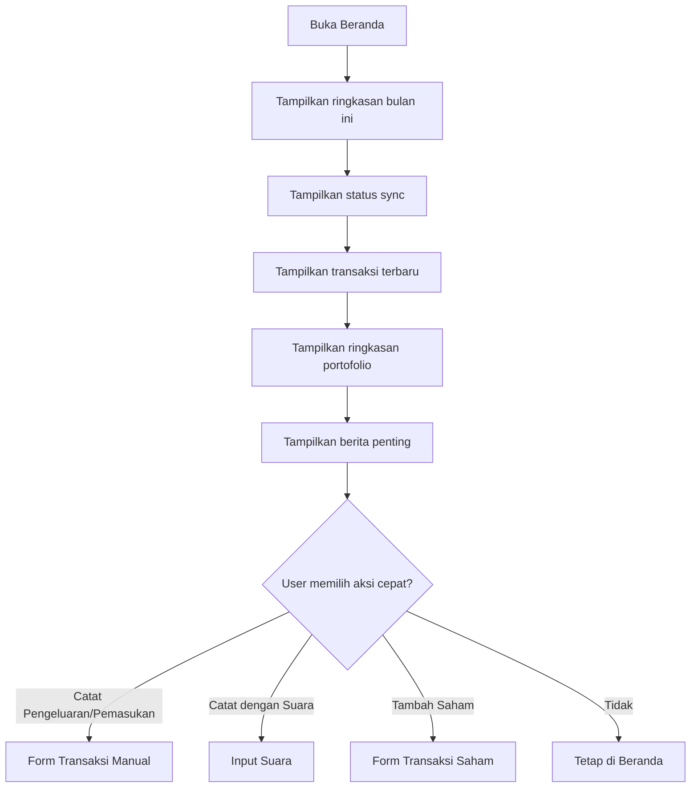

---

## 8. Flow Keuangan — Tambah Transaksi Manual

### 8.1 Alur Utama

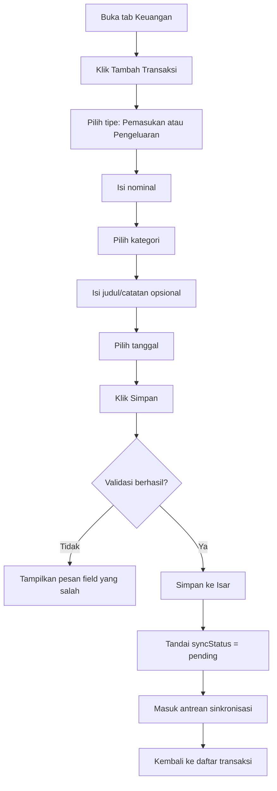

### 8.2 Field Wajib

- Tipe transaksi.
- Nominal.
- Kategori.
- Tanggal.

### 8.3 Field Opsional

- Judul.
- Catatan.
- Metode pembayaran.

### 8.4 Error State

```text
Nominal belum diisi.
```

```text
Kategori belum dipilih.
```

```text
Tanggal transaksi belum valid.
```

---

## 9. Flow Keuangan — Input Transaksi dengan Suara

Voice input harus selalu melewati halaman konfirmasi.

### 9.1 Alur Utama

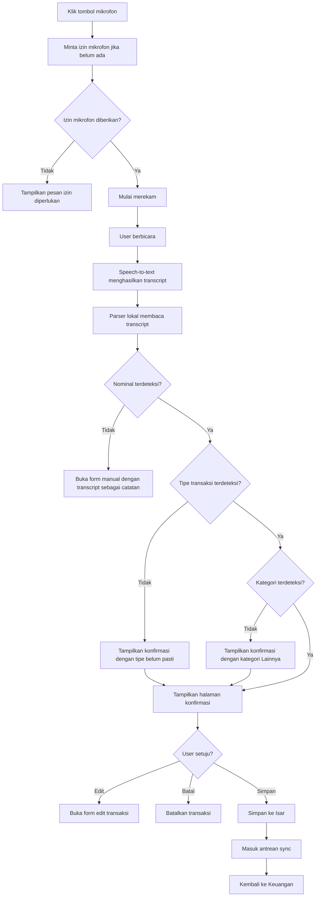

### 9.2 Contoh Input Suara

```text
Saya beli kopi 15 ribu.
```

Hasil deteksi:

```text
Tipe: Pengeluaran
Kategori: Makanan & Minuman
Nominal: Rp15.000
Judul: Kopi
Sumber: Suara
```

```text
Saya dapat uang dari orang tua 500 ribu.
```

Hasil deteksi:

```text
Tipe: Pemasukan
Kategori: Uang Orang Tua
Nominal: Rp500.000
Judul: Uang dari orang tua
Sumber: Suara
```

### 9.3 Halaman Konfirmasi Voice

Halaman konfirmasi harus menampilkan:

- Transcript asli.
- Tipe transaksi.
- Nominal.
- Kategori.
- Judul/catatan.
- Tanggal.
- Confidence score sederhana.
- Tombol Simpan.
- Tombol Edit.
- Tombol Batal.

### 9.4 Jika Parser Tidak Yakin

Jika confidence rendah, aplikasi tetap menampilkan hasil, tetapi memberi peringatan:

```text
Saya belum terlalu yakin dengan hasil ini. Silakan periksa dulu sebelum menyimpan.
```

---

## 10. Flow Edit Transaksi Keuangan

Transaksi yang sudah tersinkronisasi tetap boleh diedit dari aplikasi. Setelah diedit, sistem harus menandai transaksi sebagai perlu sinkronisasi ulang.

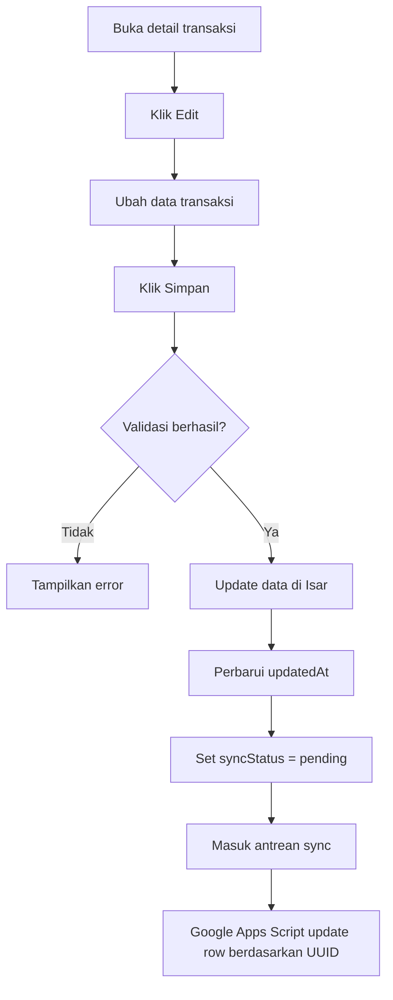

### Aturan Penting

- Edit hanya dilakukan dari aplikasi.
- Spreadsheet boleh diedit ringan, tetapi konflik diselesaikan berdasarkan `updatedAt`.
- Strategi konflik MVP: **latest updatedAt wins**.

---

## 11. Flow Sinkronisasi Google Spreadsheet Dua Arah

### 11.1 Prinsip Sync

- Penyimpanan utama: Isar.
- Cloud backup dan edit ringan: Google Spreadsheet.
- Identitas utama data: UUID.
- Strategi sync: dua arah.
- Strategi konflik: latest `updatedAt` wins.
- Delete strategy: soft delete.

### 11.2 Alur Sync Dua Arah

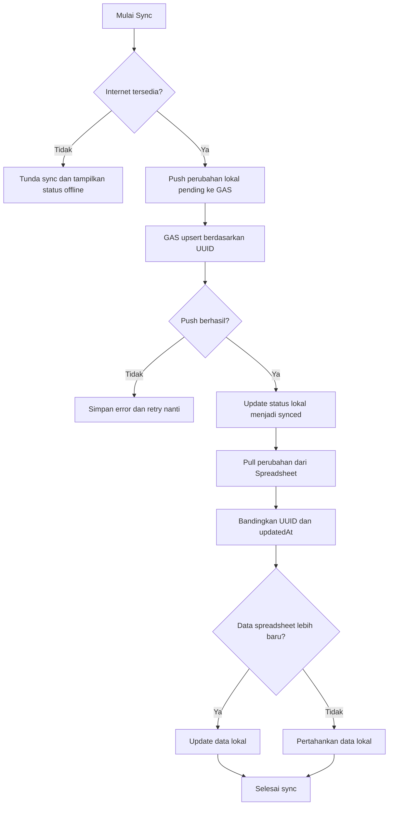

### 11.3 Status Sync

MoneyPilot harus mendukung status:

```text
Belum tersinkron
Menunggu sinkronisasi
Sedang sinkronisasi
Tersinkron
Gagal sinkronisasi
Konflik data
Offline
```

### 11.4 Microcopy Sync

```text
Semua data sudah tersinkron.
```

```text
Ada 3 data yang menunggu sinkronisasi.
```

```text
Sinkronisasi gagal. MoneyPilot akan mencoba lagi nanti.
```

```text
Perubahan dari spreadsheet ditemukan dan berhasil diperbarui ke aplikasi.
```

---

## 12. Flow Kategori Keuangan

Kategori default dibuat saat onboarding. User dapat mengubah kategori dari Pengaturan atau dari form transaksi.

### 12.1 Kategori Default

Pengeluaran:

- Makanan & Minuman
- Transportasi
- Kos/Asrama
- Kuliah
- Hiburan
- Investasi
- Tabungan
- Lainnya

Pemasukan:

- Freelance
- Uang Orang Tua
- Beasiswa
- Dividen
- Bunga
- Lainnya

### 12.2 Alur Kelola Kategori

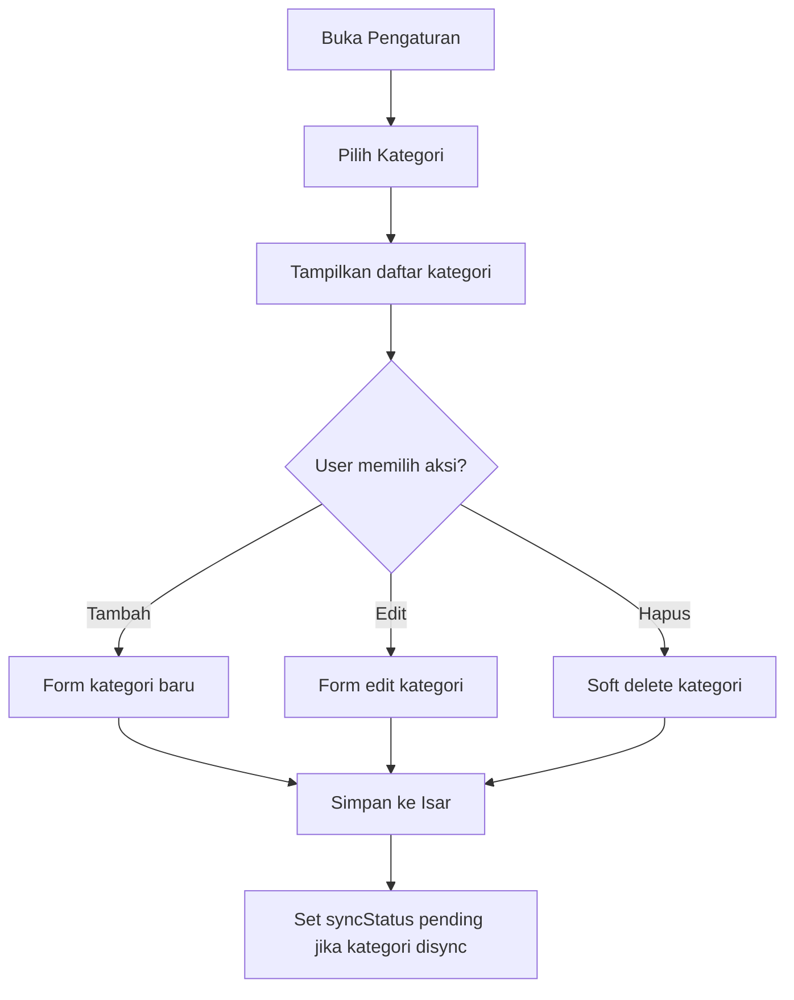

---

## 13. Flow Portofolio — Tambah Transaksi Saham

### 13.1 Tambah Pembelian Saham

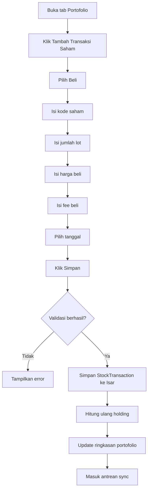

### 13.2 Tambah Penjualan Saham

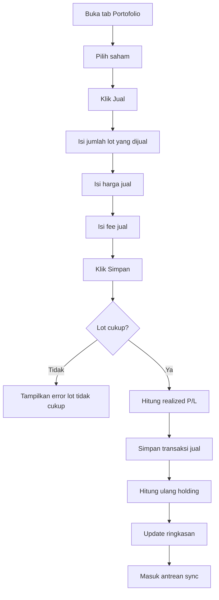

### 13.3 Validasi Portofolio

- Kode saham wajib diisi.
- Lot harus lebih dari 0.
- Harga harus lebih dari 0.
- Fee tidak boleh negatif.
- Transaksi jual tidak boleh melebihi jumlah lot tersedia.

---

## 14. Flow Portofolio — Update Harga Pasar

Harga pasar harus dicoba diambil melalui backend sejak MVP.

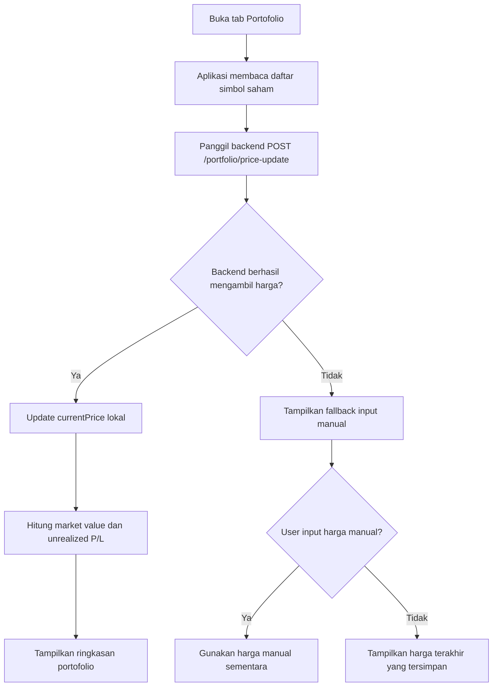

### Error State

```text
Harga pasar belum tersedia. MoneyPilot menampilkan harga terakhir yang tersimpan.
```

```text
Backend sedang tidak dapat mengambil data harga. Anda bisa memasukkan harga manual sementara.
```

---

## 15. Flow Portofolio — Catat Dividen

Dividen masuk MVP dari awal.

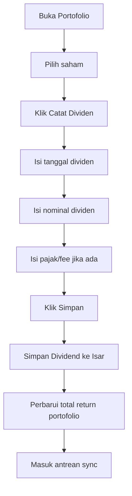

### Aturan Dividen

- Dividen menambah total return.
- Dividen tidak mengubah average price.
- Dividen juga dapat muncul sebagai pemasukan kategori Dividen di modul Keuangan jika user mengaktifkan opsi tersebut.

---

## 16. Flow Watchlist

Watchlist digunakan untuk memantau saham yang belum dimiliki atau ingin dianalisis nanti.

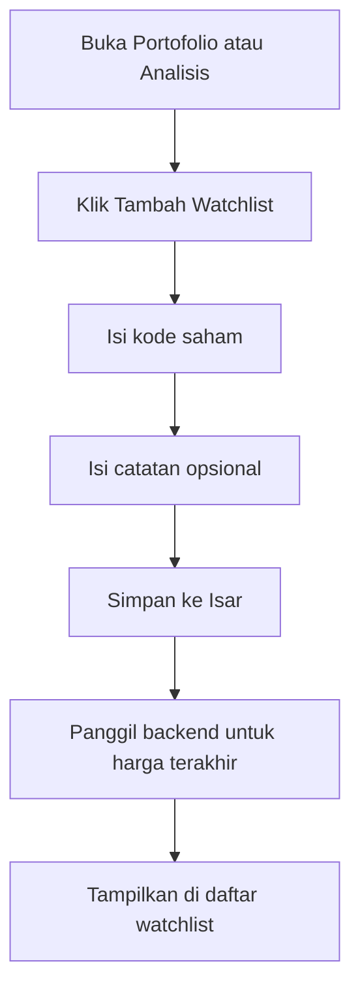

---

## 17. Flow Berita — Daftar dan Filter Berita

### 17.1 Kategori Berita

- Ekonomi Indonesia
- Ekonomi Global
- Saham
- Forex
- Komoditas
- Geopolitik
- Suku Bunga
- Inflasi
- IPO

### 17.2 Alur Daftar Berita

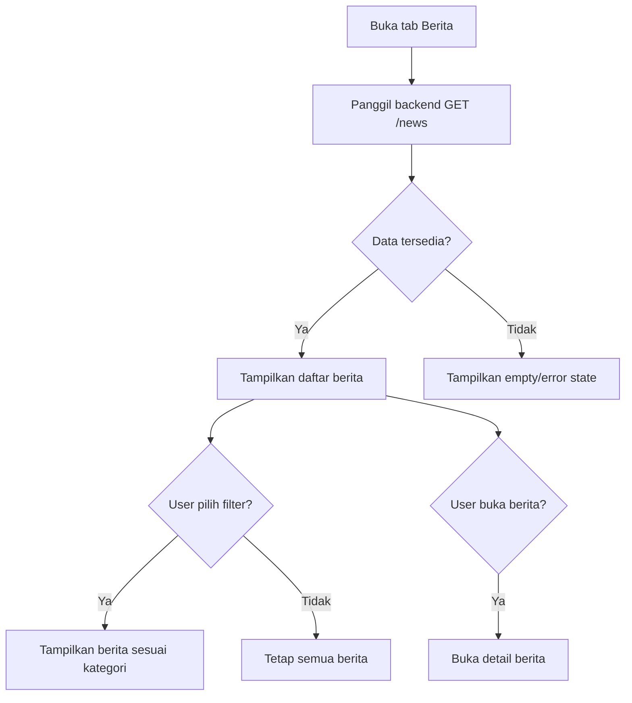

### Error State

```text
Berita belum tersedia. Coba perbarui beberapa saat lagi.
```

```text
MoneyPilot belum bisa mengambil berita karena koneksi bermasalah.
```

---

## 18. Flow Berita — Detail dan Analisis Dampak AI

Analisis berita harus langsung memakai AI backend sejak MVP.

### 18.1 Alur Analisis

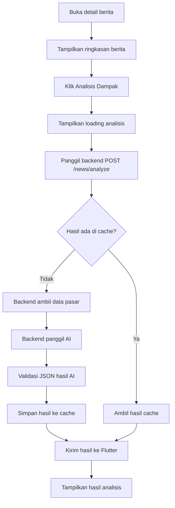

### 18.2 Komponen Hasil Analisis

Hasil analisis harus menampilkan:

- Ringkasan berita.
- Kategori berita.
- Aset yang terdampak.
- Dampak potensial.
- Rantai sebab-akibat.
- Data pendukung.
- Skenario positif.
- Skenario negatif.
- Impact score.
- Confidence score.
- Hal yang perlu dipantau.
- Kesimpulan untuk pemula.
- Disclaimer.

### 18.3 Jika Data Pasar Tidak Lengkap

```text
Data pasar belum cukup untuk membuat analisis dengan keyakinan tinggi. MoneyPilot tetap menampilkan penjelasan awal, tetapi confidence score diturunkan.
```

### 18.4 Jika AI Backend Gagal

```text
Analisis belum bisa dibuat sekarang. Berita tetap bisa dibaca, dan Anda dapat mencoba lagi nanti.
```

---

## 19. Flow Bookmark Berita

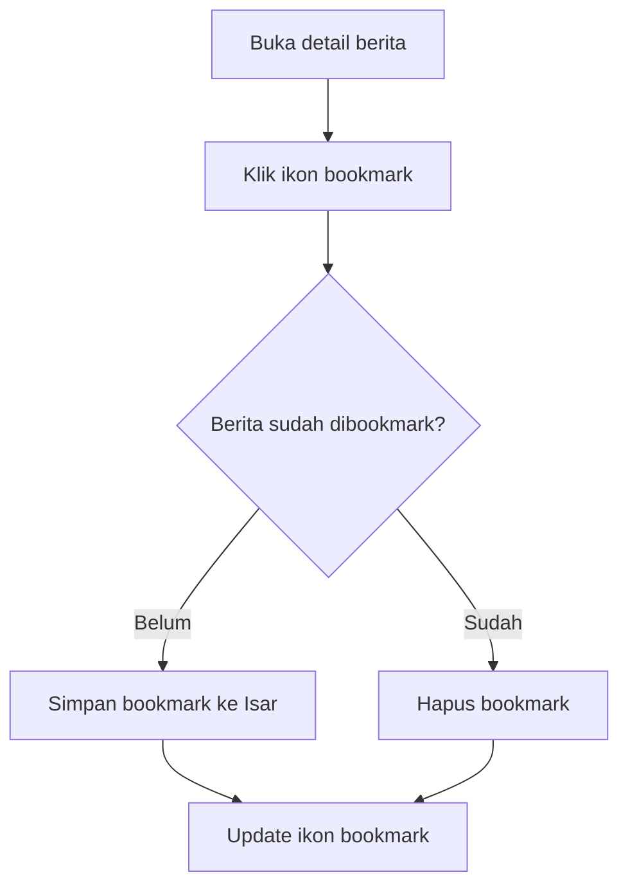

Bookmark harus tetap tersedia saat offline.

---

## 20. Flow Analisis Tab

Tab Analisis disiapkan untuk pengembangan analisis saham/forex di masa depan. Pada MVP, tab ini tidak boleh kosong total. Harus ada placeholder yang informatif.

### 20.1 Isi Tab Analisis MVP

- Penjelasan bahwa fitur analisis mendalam sedang disiapkan.
- Watchlist sederhana.
- Catatan analisis manual.
- Disclaimer edukasi.

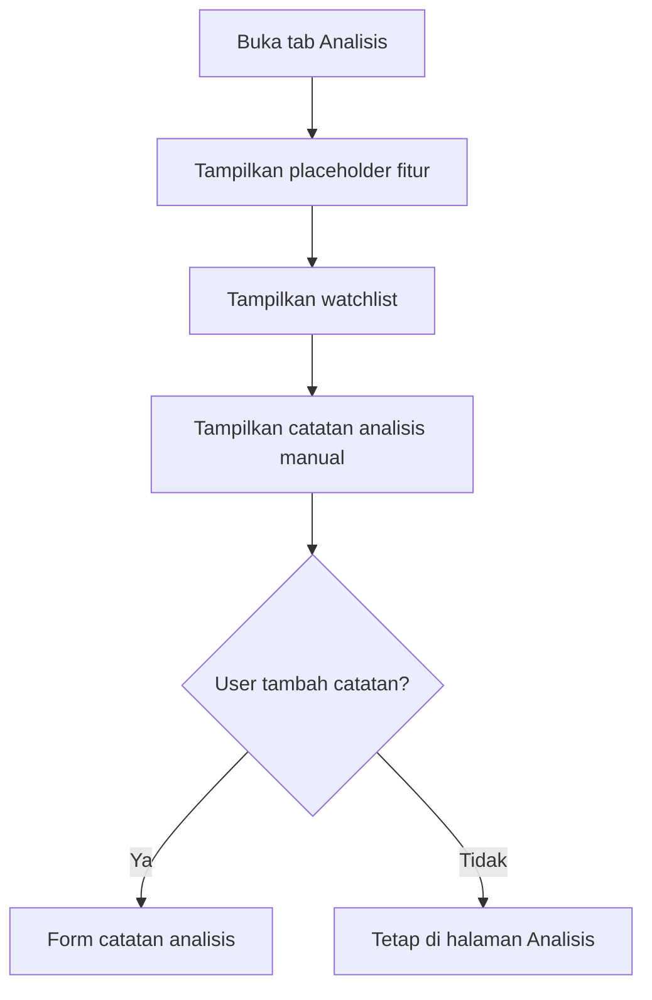

### Microcopy

```text
Fitur analisis saham dan forex sedang disiapkan. Untuk saat ini, Anda bisa menyimpan watchlist dan catatan analisis pribadi.
```

---

## 21. Flow Pengaturan

Pengaturan dapat diakses dari Beranda melalui ikon settings.

### 21.1 Menu Pengaturan

- Profil lokal.
- Fingerprint/biometric lock.
- Google Spreadsheet.
- Kategori.
- Fee saham.
- Sinkronisasi manual.
- Backup/export CSV.
- Reset data.
- Tentang MoneyPilot.
- Disclaimer.

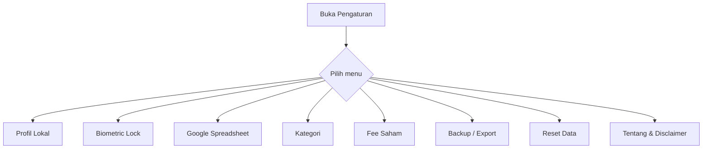

---

## 22. Flow Export dan Backup

Selain sync spreadsheet, user dapat mengekspor data ke CSV.

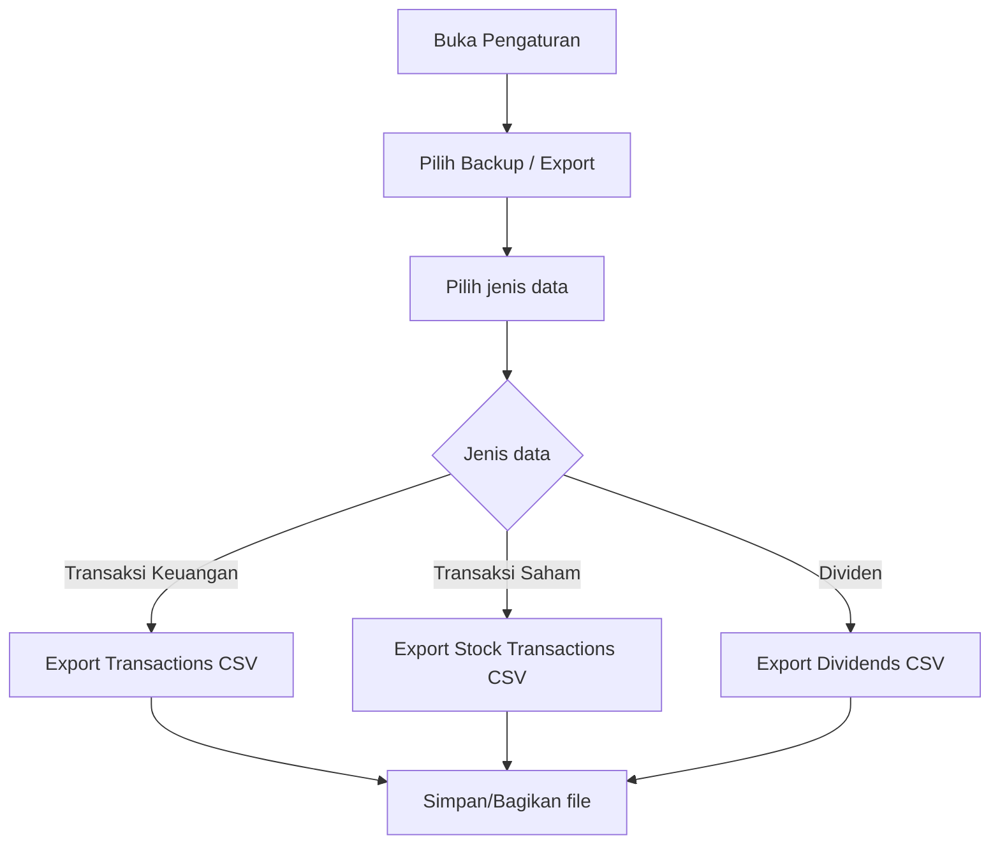

---

## 23. Flow Reset Data

Reset data adalah aksi berisiko dan harus diberi konfirmasi ganda.

```mermaid
graph TD
    A[Buka Pengaturan] --> B[Pilih Reset Data]
    B --> C[Tampilkan peringatan]
    C --> D{User setuju?}
    D -->|Tidak| E[Batal]
    D -->|Ya| F[Minta ketik RESET]
    F --> G{Input benar?}
    G -->|Tidak| E
    G -->|Ya| H[Hapus/soft reset data lokal]
    H --> I[Kembali ke Onboarding]
```

### Microcopy

```text
Tindakan ini akan menghapus data lokal di perangkat. Pastikan data sudah tersinkron atau diekspor sebelum melanjutkan.
```

---

## 24. Offline Flow

MoneyPilot harus tetap bisa dipakai saat offline untuk fitur lokal.

### 24.1 Fitur yang Tetap Bisa Dipakai Offline

- Buka aplikasi setelah biometric.
- Lihat transaksi tersimpan.
- Tambah transaksi manual.
- Tambah transaksi dengan suara jika speech-to-text lokal tersedia.
- Edit transaksi.
- Lihat portofolio dengan harga terakhir.
- Catat transaksi saham.
- Catat dividen.
- Lihat bookmark berita tersimpan.

### 24.2 Fitur yang Terbatas Saat Offline

- Sync spreadsheet.
- Update harga pasar.
- Ambil berita terbaru.
- Analisis AI berita.

```mermaid
graph TD
    A[User offline] --> B{Aksi membutuhkan internet?}
    B -->|Tidak| C[Jalankan lokal]
    B -->|Ya| D[Tampilkan offline state]
    D --> E[Simpan request jika bisa diantrekan]
    E --> F[Retry saat online]
```

### Microcopy

```text
Anda sedang offline. Data baru tetap tersimpan di perangkat dan akan disinkronkan saat koneksi kembali tersedia.
```

---

## 25. Empty State Flow

### 25.1 Belum Ada Transaksi

```text
Belum ada transaksi. Mulai catat pengeluaran atau pemasukan pertama Anda.
```

Aksi:

- Catat Manual
- Catat dengan Suara

### 25.2 Belum Ada Portofolio

```text
Belum ada saham di portofolio. Tambahkan transaksi beli saham pertama Anda.
```

Aksi:

- Tambah Transaksi Saham
- Tambah Watchlist

### 25.3 Belum Ada Berita

```text
Berita belum tersedia. Coba perbarui beberapa saat lagi.
```

Aksi:

- Muat Ulang

### 25.4 Belum Ada Analisis

```text
Pilih berita terlebih dahulu untuk membuat analisis dampak berbasis data.
```

---

## 26. Error State Flow

### 26.1 Backend Tidak Tersedia

```text
Server MoneyPilot belum dapat dihubungi. Fitur lokal tetap bisa digunakan.
```

### 26.2 Spreadsheet Tidak Valid

```text
URL spreadsheet belum valid. Periksa kembali pengaturan Google Apps Script Anda.
```

### 26.3 Secret Token Salah

```text
Sinkronisasi ditolak. Secret token tidak sesuai.
```

### 26.4 Data Harga Saham Gagal Diambil

```text
Harga pasar gagal diperbarui. MoneyPilot memakai harga terakhir yang tersimpan.
```

### 26.5 Analisis AI Gagal

```text
Analisis belum bisa dibuat sekarang. Coba lagi nanti.
```

---

## 27. Loading State Flow

MoneyPilot harus menggunakan loading yang ringan dan tidak mengganggu.

### Loading yang dibutuhkan

- Splash loading.
- Sync loading.
- Fetch berita loading.
- Analisis AI loading.
- Update harga saham loading.
- Export CSV loading.

Microcopy:

```text
Sedang menyinkronkan data...
```

```text
Sedang mengambil berita terbaru...
```

```text
Sedang menyusun analisis berbasis data...
```

```text
Sedang memperbarui harga portofolio...
```

---

## 28. Tab Persistence

Bottom navigation harus menjaga state setiap tab agar tidak reload terus-menerus.

Rekomendasi implementasi:

```text
Gunakan IndexedStack atau ShellRoute GoRouter agar state tab tetap tersimpan.
```

Contoh perilaku:

- User membuka filter Berita.
- User pindah ke Keuangan.
- User kembali ke Berita.
- Filter sebelumnya tetap aktif.

---

## 29. Deep Link / Future Consideration

Untuk MVP, deep link tidak wajib. Namun struktur routing harus disiapkan agar nanti bisa mendukung:

```text
/money/:transactionId
/portfolio/:symbol
/news/:newsId
/analysis/:id
/settings
```

---

## 30. Ringkasan Flow Kritis untuk Codex

Codex wajib memprioritaskan flow berikut:

1. Splash → biometric → Beranda.
2. Onboarding → setup awal → Beranda.
3. Tambah transaksi manual → simpan lokal → sync queue.
4. Voice input → parser → konfirmasi → simpan lokal → sync queue.
5. Sync dua arah Isar ↔ Google Spreadsheet.
6. Edit transaksi tersinkron → upsert spreadsheet berdasarkan UUID.
7. Tambah transaksi saham beli/jual → hitung ulang portofolio.
8. Update harga saham via backend → fallback harga terakhir/manual.
9. Catat dividen → total return portofolio.
10. Berita → detail → analisis AI backend → tampilkan confidence score.
11. Offline state → tetap bisa pakai fitur lokal.
12. Error state → tidak membuat aplikasi crash.

---

## 31. Catatan Implementasi untuk Codex

1. Semua teks UI wajib Bahasa Indonesia.
2. Bottom navigation wajib berurutan: Beranda, Berita, Keuangan, Portofolio, Analisis.
3. Jangan membuat login server pada MVP.
4. Gunakan biometric lokal perangkat, bukan sistem akun.
5. Input suara tidak boleh langsung menyimpan transaksi tanpa konfirmasi.
6. Semua entity mutasional harus punya UUID.
7. Sync spreadsheet wajib upsert berdasarkan UUID.
8. Sync dua arah wajib memakai `updatedAt` untuk penyelesaian konflik.
9. Delete harus soft delete.
10. Portofolio dihitung dari riwayat transaksi saham, bukan input holding statis.
11. Dividen harus didukung dari MVP.
12. Harga saham harus dicoba melalui backend, tetapi harus ada fallback.
13. Analisis berita harus melalui backend AI, bukan dibuat langsung di Flutter.
14. Jika AI/backend gagal, aplikasi tetap bisa membaca berita.
15. UI harus minimalis dan tidak memakai card berlebihan.

---

## 32. Definition of Done untuk User Flow

Dokumen User Flow dianggap berhasil jika:

1. Semua tab utama memiliki flow yang jelas.
2. Semua fitur MVP dalam PRD memiliki alur penggunaan.
3. Semua flow kritis memiliki error/offline state.
4. Flow sync dua arah sudah menjelaskan konflik data.
5. Flow voice input wajib melewati konfirmasi.
6. Flow portofolio mencakup beli, jual, update harga, dan dividen.
7. Flow berita mencakup daftar, detail, bookmark, dan analisis AI.
8. Bahasa seluruh flow konsisten dalam Bahasa Indonesia.
9. Mermaid flowchart tersedia untuk flow utama.
10. Codex dapat memakai dokumen ini untuk membuat routing dan screen tanpa menebak-nebak.